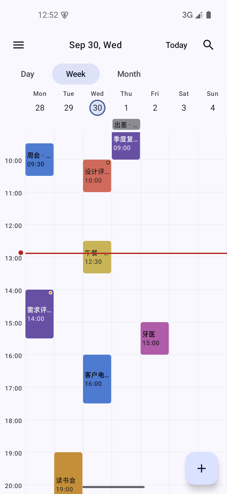
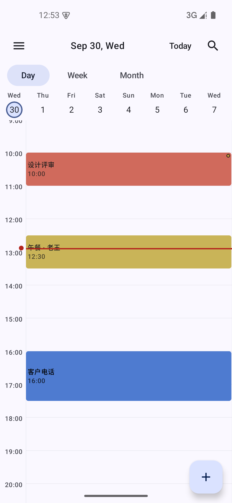
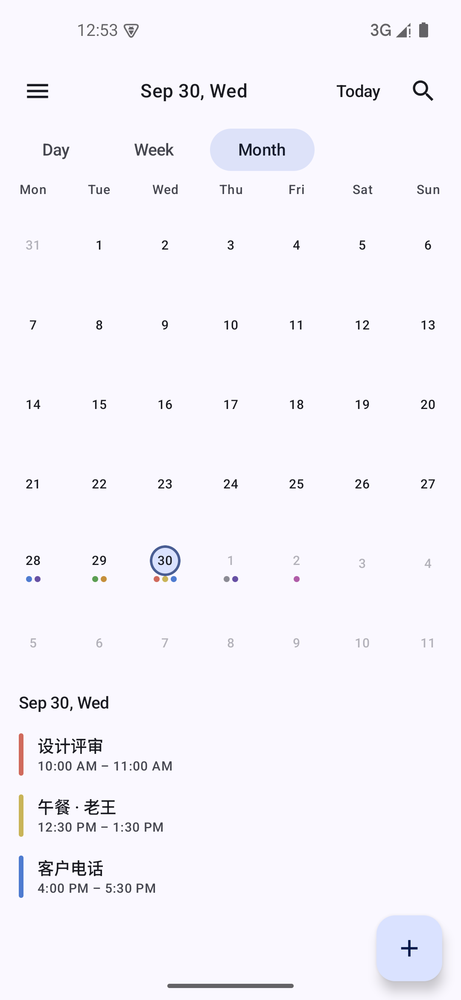
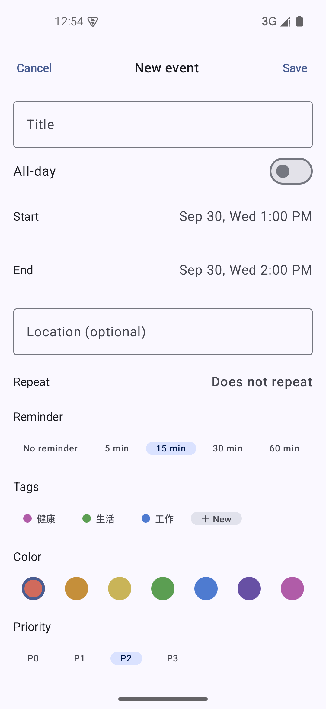
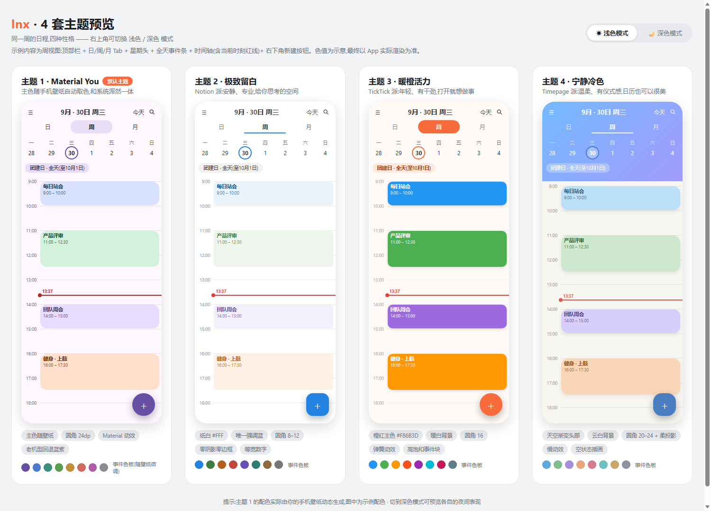

# lnx

**轻快、好看的 Android 日程管理**。日 / 周 / 月三视图、用户自建标签、重复事件、到点提醒、搜索、JSON 导入导出，配 4 套免费主题。

单模块 Kotlin + Jetpack Compose 手写，第三方依赖只来自官方仓库。完整需求见 [SPEC.md](SPEC.md)。

<p align="center">
  
  
  
  
</p>

## 四套主题

同一份数据、四套气质 —— 颜色不是写死的色值，而是**色位编号**（0–7）由各主题翻译，
换主题时事件颜色自动跟随；浅色 / 深色 / 跟随系统各自独立。

<p align="center">
  
</p>

（这是设计稿 [theme-preview.html](theme-preview.html) 的渲染图，与 App 实际渲染一致。）

## 功能

| | |
|---|---|
| **三视图** | 周（默认）/ 日 / 月，左右滑动翻页，点空白处按 30 分钟吸附新建 |
| **重复事件** | 每天 / 每周 / 每月（按日期或按第 N 个星期几）/ 每年，三种结束方式；改单次 / 改本次及以后 / 改全部 |
| **提醒** | 精确闹钟 + 窗口闹钟兜底、免打扰时段、开机与改时区自动重排 |
| **标签** | 用户自建、8 色、多对多，抽屉里按标签筛选 |
| **搜索** | 搜标题 / 备注 / 地点，跳转后高亮那一条并滚到它 |
| **导入导出** | 完整 JSON 备份，合并或覆盖（覆盖有二次确认），换手机不丢数据 |
| **其他** | 全天与跨天事件、优先级、事件色位、首次启动 3 页引导、中英双语、无障碍朗读 |

## 技术栈

- **Kotlin 2.0** + **Jetpack Compose** + **Material 3**，单 Activity
- **Hilt** 依赖注入、**Room** 本地库（正式迁移链，不丢数据）、**DataStore** 设置
- **kotlinx.serialization** 备份编解码
- minSdk 26 / targetSdk 35，无任何非官方依赖

## 构建

```bash
# 调试包
./gradlew :app:assembleDebug

# 发布包（R8 混淆 + 资源压缩 + 签名，约 1.7 MB；调试包约 11.6 MB）
./gradlew :app:assembleRelease
```

发布包需要仓库根目录有 `keystore.properties`（不入库）。文件不存在时 `assembleRelease`
仍能编出**未签名**的 APK，只是装不上 —— 这样克隆下来的人不会因为缺凭据直接构建失败。
要发自己的版本请看 [docs/RELEASE.md](docs/RELEASE.md)。

## 测试

```bash
./gradlew :app:testDebugUnitTest          # 236 条单测（纯 JVM）
./gradlew :app:connectedDebugAndroidTest  # 156 条仪器测试（需模拟器/真机）
```

跑发版流程之前两条都要绿。几条专门用来挡回归的闸门：

- `MigrationChainTest` —— 挡住了「涨了数据库版本却忘了写迁移」；
  真正的迁移正确性由 `MigrationTest` 拿 Room 导出的 schema 快照逐版本比对。
- `AccessibilityGateTest` —— 挡住「可点、有面积、读屏却念不出内容」的控件。
- `lintVitalRelease` —— 只在 release 构建跑，manifest / 资源上的错误会直接让打包失败。

## 项目结构

```
app/src/main/java/com/lnx/app/
├── core/
│   ├── database/       Room 实体 / DAO / 迁移（DbVersion 是唯一的库版本号）
│   ├── domain/         纯逻辑：重复规则引擎、展开器、标签筛选、搜索
│   ├── data/           仓库实现
│   ├── backup/         JSON 备份的模型与编解码
│   ├── notification/   提醒排期、闹钟、通知
│   └── designsystem/   4 套主题、色位映射、字体与圆角
└── feature/
    ├── calendar/       三视图 + 抽屉
    ├── event/          事件编辑器与详情卡
    ├── search/ settings/ onboarding/
```

## 文档

- [SPEC.md](SPEC.md) —— 产品规格（冻结版本，含逐条决策记录）
- [docs/RELEASE.md](docs/RELEASE.md) —— 发版手册：两条版本线的区别、密钥怎么管、发版与走查清单
- `docs/superpowers/plans/` —— 各里程碑的实施计划
- `docs/acceptance/` —— 各里程碑的验收证据

## 说明

- 这是个人项目，没有发布到任何应用商店。想自己编一个装到手机上，照着[发版手册](docs/RELEASE.md)走即可。
- 仓库里没有 LICENSE 文件，即默认保留所有权利。想拿去用请先开个 issue 聊一下。
