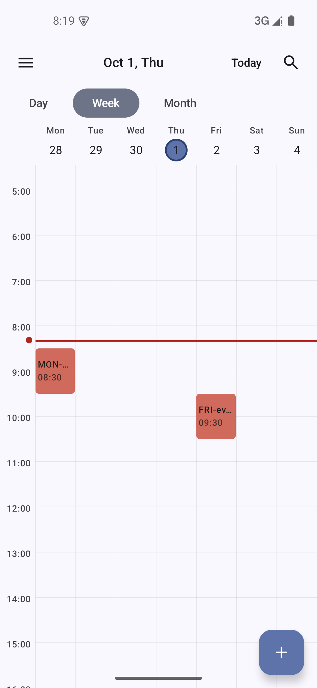

# v0.1.1 验收证据

## 这一版只干一件事:把能装的包发出去

`v0.1.0` 标签之后,仓库里只多了两个**纯文档**的提交(加 LICENSE、补真机验证记录),
一行代码都没改。GitHub 上那个 `v0.1.0` Release 的附件栏是空的 —— 谁都下载不到 APK。

所以 v0.1.1 的全部内容是:

- `versionCode` 1 → 2、`versionName` 0.1.0 → 0.1.1(Android 靠 versionCode 判断"能不能覆盖安装",
  不涨的话手机上那个包装不上去)
- 重新构建一次签名发布包,并把发布包本身验一遍

## 验的是发布包,不是源码

仪器测试跑的是未混淆的源码。这里要回答的是另一个问题:**R8 混淆 + 资源压缩之后,
那个跨列渲染的修复还在不在**。所以装的是 `app-release.apk`,两个事件都是手工点出来的。

两个事件:

| 事件 | 时间 | 应在的列 |
|---|---|---|
| MON-event | 9/28 周一 8:30–9:30 | 第 1 列(Mon) |
| FRI-event | 10/2 周五 9:30–10:30 | 第 5 列(Fri) |

截图里 MON 在第一列、FRI 在 Fri 表头正下方,两块横向不重叠 —— 修复在发布包里生效。
(修复前这两块会**都**画在第一列,只是上下错开;单日数据看不出来,这正是它当初潜伏
九个里程碑的原因。)

## 同时记下的核对项

- **签名**:`apksigner verify --print-certs` → `CN=lnx, OU=personal, O=lnx, C=CN`,
  SHA-256 `104f3223f519f1a9bef3dfa38e2e703b2dab472ac915a887ee4943ba2e80edc2`
- **版本号**:`aapt2 dump badging` → `versionCode='2' versionName='0.1.1'`
- **体积**:1,716,500 字节(1.64 MB)
- **`lintVitalRelease`**:构建里跑过,没报致命问题
- **单测**:236 条,0 失败

## 环境

- 模拟器 `test35`(Android 15 / API 35),系统语言英文
- 发布包 `app-release.apk`(R8 混淆 + 资源压缩 + 正式签名)
- 新装(先 `adb uninstall`,避免旧签名包报 `INSTALL_FAILED_UPDATE_INCOMPATIBLE`)
- 首次启动的三页引导走了一遍,通知权限这次点了 Allow

## 没验的

- 仪器测试(156 条)这次没重跑。改的只有两个常量,发布包本身又是手工验过的,
  收益不抵那几十分钟。
- 系统备份 / 换机迁移恢复:依旧没验,建议还是别验(见 `docs/RELEASE.md` 第五节)。
