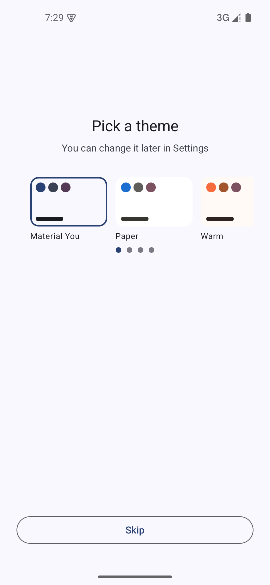
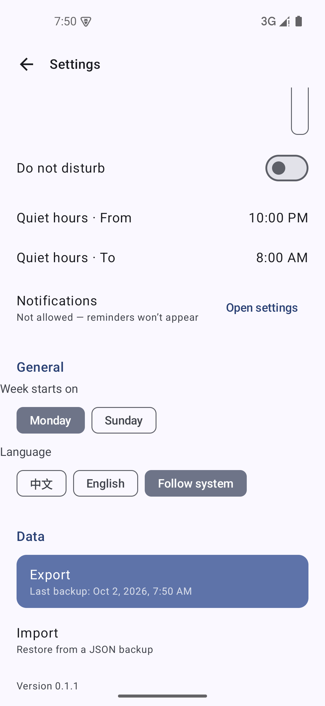

# v0.2 验收证据(补欠账阶段)

v0.2 现范围 = 四件补欠账(见 `docs/PLAN-v0.2.md` 顶部说明:课表暂停、整体撤出主线)。
这里按完成顺序归档走查截图。

## 补欠账 ①:引导页/设置页主题卡滑动提示

修复前的事实:4 张主题卡(4×112dp + 间距 + 边距 ≈ 524dp)在手机屏(约 392dp)上放不下,
**第 4 张「宁静冷色」完整地藏在屏幕右边缘之外,连一条边都不露** —— 用户不知道右边还有东西。
设置页与引导页共用同一个 `ThemeCardRow`,两处一起修。

两重提示(引导页与设置页同款):

1. **底部一排 4 个位置圆点**,滑到哪儿亮到哪儿;整行放得下时不画(平板不凭空多一行);
2. **引导页首次出现时自动"滑到底再弹回来"一次**(autoPeek),亲手演示比文字提示有效。
   演示有保险:用户已经自己滑过就不再动手,不然会把用户正在看的位置硬拽回去
   (这个边界是被测试逼出来的,见下)。

配套仪器测试 `OnboardingTest.第4张主题卡藏在屏幕外_有圆点提示_向左滑之后可达`:
断言圆点存在 + 向左滑之后第 4 张卡真的进语义树(LazyRow 不组装屏幕外的项,
"存在且有尺寸"本身就是"看得到"的证据)。

## 补欠账 ②:导出备份更醒目 + 上次备份时间

修复前的事实:导出和导入是设置页里两行长得一模一样的文字。但备份是**唯一**的换机逃生通道。

- 导出行铺主题色底,长成"该点它"的样子;导入保持朴素行
- 副标题动态显示备份状态:**从未导出时显示"从未备份过"**
- 导出**成功落盘**后记入设置(`last_export_at`),失败不记账
  (仪器测试里"写文件失败不得记账"专门锁了这条)

实机导出一次后:

副标题变成 "Last backup: Oct 2, 2026, 7:50 AM",分享面板正常弹出
`lnx-backup-20261002.json`。

### 顺带拆掉的地雷:日期炸弹测试

全量仪器测试跑到 `BackupErrorClassificationTest.导出成功给文件名并把内容写出去` 报红,
排查后与本次改动无关:这条测试把期望文件名**写死成了 20260930**,9 月 30 日之后天天红
—— 全量套件上一次跑是 9 月 30 日,所以一直没人发现。已改为按"今天"现算期望值。

## 环境

- 模拟器 `test35`(Android 15 / API 35),系统语言英文,debug 包
- 时间:2026-10-02
